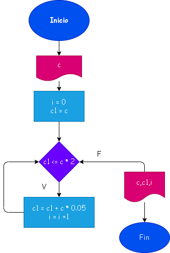

# Ejercicio 26 : Con el capital, en cuantos meses se duplica.

# Analisis
Primer dia : 10.000 ,se suma el 5% de esta
Segundo dia : 10.500 ,se suma el 5% de esta
Tercer dia : 11.025 ,se suma el 5% de esta
n dias : 20.000 

